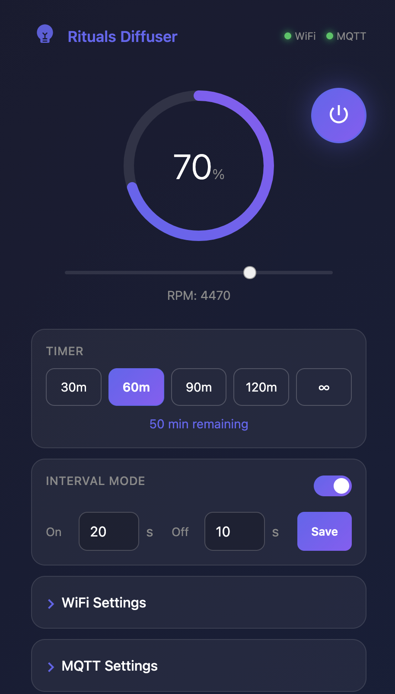
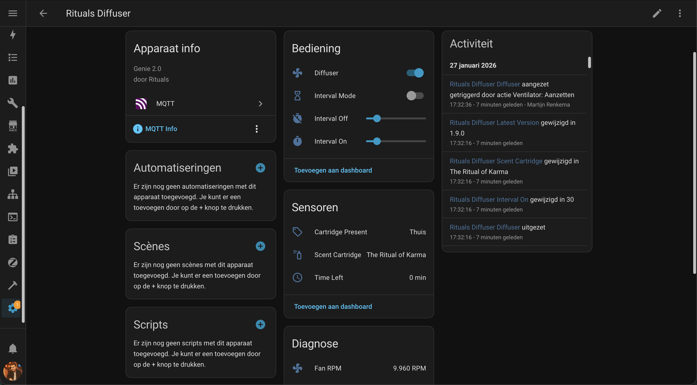
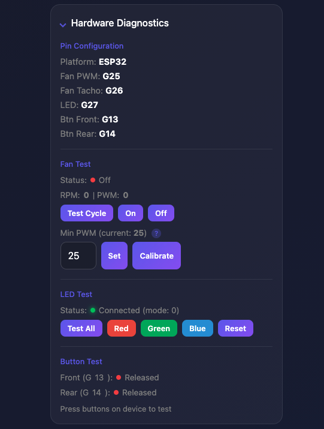

# Rituals Perfume Genie 2.0 - Custom Firmware

Custom firmware for the Rituals Perfume Genie 2.0 diffuser. Replaces the cloud-dependent Rituals firmware with fully local control via Home Assistant.

<p align="center">
  
</p>


> **Looking for ESP8266 testers!** The ESP8266 version builds successfully but has not been tested on actual hardware. If you have an original Rituals Genie with ESP-WROOM-02, please help test and [report any issues](https://github.com/martijnrenkema/Rituals-diffuser/issues).

## Features

- **Local Control** - No cloud dependency, works offline
- **Home Assistant Integration** - MQTT auto-discovery
- **Timer Presets** - 30, 60, 90, 120 minutes + continuous
- **Interval Mode** - Pulsing mode to save fragrance
- **Night Mode** - Auto-dim LED during configured hours
- **Usage Statistics** - Track total runtime
- **OTA Updates** - Wireless firmware updates via web interface
- **Web Interface** - Configure WiFi, MQTT, passwords, and control the diffuser
- **RGB LED Status** - Visual feedback for device state
- **Physical Buttons** - Front and rear button support

## Quick Start

### Option 1: Pre-built Binaries (Easiest)

1. Download the latest release from [Releases](https://github.com/martijnrenkema/Rituals-diffuser/releases)
2. Flash using esptool or web flasher (see Installation section)

### Option 2: Build from Source

```bash
# Clone repository
git clone https://github.com/martijnrenkema/Rituals-diffuser.git
cd Rituals-diffuser

# Build for ESP32 (recommended)
pio run -e esp32dev

# Or build for ESP8266 (original chip)
pio run -e esp8266
```

## Hardware

This firmware supports both **ESP32** (recommended) and the original **ESP-WROOM-02** (ESP8266).

### ESP32 Wiring (Recommended for new builds)

Connect your ESP32 DevKit to the Rituals Genie board:

| ESP32 GPIO | Genie Board | Wire Color | Function |
|------------|-------------|------------|----------|
| GPIO25 | IO4 | Blue | Fan PWM speed control |
| GPIO26 | IO5/TP17 | Yellow | Fan tachometer (RPM) |
| GPIO27 | IO15 | Green | WS2812 RGB LED data |
| GPIO13 | SW2 | - | Front button (Connect) |
| GPIO14 | SW1 | - | Rear button (Reset) |
| GND | GND | Black | Ground |
| 3.3V | 3.3V | Red | Power |

> **⚠️ Important: Antenna Placement**
>
> When installing an ESP32 dev board inside the metal housing, position the board so the WiFi antenna points toward the nozzle opening. The metal enclosure acts as a Faraday cage, blocking WiFi signals. The nozzle opening is the only path for the signal to escape.

### ESP8266 Pinout (Original chip)

| GPIO | Function | Description |
|------|----------|-------------|
| GPIO4 | Fan PWM | Speed control (blue wire) |
| GPIO5 | Fan Tacho | RPM feedback (yellow wire) |
| GPIO15 | LED | WS2812 RGB LED |
| GPIO14 | SW2 | Connect button |
| GPIO13 | SW1 | Cold reset button |

## Installation

### Step 1: Backup Original Firmware (Important!)

Before flashing, backup the original Rituals firmware:

```bash
# Find your serial port
ls /dev/cu.usbserial-*

# Backup (2MB flash for ESP8266)
esptool.py --port /dev/cu.usbserial-XXXX read_flash 0x00000 0x200000 rituals_backup.bin
```

### Step 2: Flash Firmware

#### Method A: Using PlatformIO (Recommended)

```bash
# For ESP32
pio run -e esp32dev -t upload --upload-port /dev/cu.usbserial-XXXX
pio run -e esp32dev -t uploadfs --upload-port /dev/cu.usbserial-XXXX

# For ESP8266
pio run -e esp8266 -t upload --upload-port /dev/cu.usbserial-XXXX
pio run -e esp8266 -t uploadfs --upload-port /dev/cu.usbserial-XXXX
```

#### Method B: Using esptool (Pre-built binaries)

```bash
# For ESP32
esptool.py --port /dev/cu.usbserial-XXXX --chip esp32 --baud 460800 \
  write_flash -z 0x10000 firmware.bin

# For ESP8266
esptool.py --port /dev/cu.usbserial-XXXX --chip esp8266 --baud 460800 \
  write_flash 0x0 firmware.bin
```

### Step 3: Initial Setup

1. Power on the device - LED will pulse orange (AP mode)
2. Connect to WiFi network: `Rituals-Diffuser-XXXX`
3. Password: `diffuser123`
4. Open browser: `http://192.168.4.1`
5. Configure your WiFi credentials
6. Device restarts and connects to your network

### Step 4: Configure MQTT (Optional)

1. Find device IP in your router or use `rituals-diffuser.local`
2. Open web interface
3. Enter MQTT broker settings
4. Device appears automatically in Home Assistant

## Updating Firmware (OTA)

Once installed, you can update wirelessly via the web interface:

1. Open web interface: `http://rituals-diffuser.local` or device IP
2. Click "Firmware Update" at bottom
3. Upload new `.bin` file
4. Wait for restart

Or via command line:
```bash
pio run -e esp32dev_ota -t upload
```

## Home Assistant Integration

### MQTT Auto-Discovery

The device automatically appears in Home Assistant when MQTT auto-discovery is enabled. No manual configuration needed!

<p align="center">
  
</p>

### Entities Created

| Entity | Type | Description |
|--------|------|-------------|
| Diffuser | Fan | On/off, speed 0-100%, timer presets |
| Interval Mode | Switch | Pulsing mode toggle |
| Interval On | Number | On-time (10-120 sec) |
| Interval Off | Number | Off-time (10-120 sec) |
| Time Left | Sensor | Remaining timer minutes |
| Fan RPM | Sensor | Current fan speed |
| WiFi Signal | Sensor | Signal strength (dBm) |
| Total Runtime | Sensor | Total device runtime (hours) |

### Timer Presets

- 30 minutes
- 60 minutes
- 90 minutes
- 120 minutes
- Continuous

## Button Controls

### Front Button (SW2 - Connect)
| Action | Function |
|--------|----------|
| Short press | Toggle fan on/off |
| Long press (3s) | Start AP mode for WiFi config |

### Rear Button (SW1 - Cold Reset)
| Action | Function |
|--------|----------|
| Short press | Restart device |
| Long press (3s) | Factory reset (clears all settings) |

## LED Status Indicators

| Color | Pattern | Status |
|-------|---------|--------|
| Red | Blinking | Startup / Error |
| Cyan | Fast blink | Connecting to WiFi |
| Green | Solid | Connected, fan running |
| Blue | Solid | Timer active |
| Purple | Solid | Interval mode active |
| Orange | Pulsing | AP mode (WiFi config) |
| Purple | Fast blink | OTA update in progress |

## Configuration

### Default Passwords

| Function | Default Password | Changeable |
|----------|------------------|------------|
| WiFi AP | `diffuser123` | Yes |
| OTA Updates | `diffuser-ota` | Yes |

Change passwords in web interface under "Security". Minimum 8 characters. Restart required after change.

### Night Mode

Automatically dims the LED during specified hours:
- Configure start/end hour (0-23)
- Set dimmed brightness (0-100%)
- Enable/disable via web interface

## Troubleshooting

### Device won't connect to WiFi
1. Long press front button (3s) to enter AP mode
2. Connect to `Rituals-Diffuser-XXXX`
3. Reconfigure WiFi settings

### Device not appearing in Home Assistant
1. Verify MQTT broker settings
2. Check MQTT broker is reachable
3. Power cycle the device
4. Wait 30 seconds for discovery

### OTA upload fails
1. Ensure device is on same network
2. Try using IP address instead of hostname
3. Check port 3232 is not blocked
4. Fallback: flash via serial connection

### Fan not spinning
1. Check wiring connections
2. Go to Hardware Diagnostics in web interface
3. Try "Test Cycle" to verify fan works
4. Adjust Min PWM if fan needs higher starting voltage

<p align="center">
  
</p>

## Project Structure

```
├── src/
│   ├── main.cpp              # Main entry point
│   ├── config.h              # Pin definitions & settings
│   ├── fan_controller.*      # Fan control, timer, interval
│   ├── led_controller.*      # WS2812 RGB LED
│   ├── button_handler.*      # Button input handling
│   ├── storage.*             # Settings persistence
│   ├── wifi_manager.*        # WiFi connection
│   ├── web_server.*          # Web interface + OTA
│   ├── mqtt_handler.*        # MQTT + HA discovery
│   └── ota_handler.*         # ArduinoOTA
├── data/                     # Web files (SPIFFS)
│   ├── index.html
│   ├── update.html
│   ├── style.css
│   └── script.js
├── platformio.ini
└── README.md
```

## Building from Source

### Prerequisites
- [PlatformIO](https://platformio.org/) (VS Code extension or CLI)
- USB-to-Serial adapter

### Build Commands

```bash
# Build firmware
pio run -e esp32dev        # ESP32
pio run -e esp8266         # ESP8266

# Build filesystem
pio run -e esp32dev -t buildfs
pio run -e esp8266 -t buildfs

# Upload firmware
pio run -e esp32dev -t upload
pio run -e esp8266 -t upload

# Upload filesystem
pio run -e esp32dev -t uploadfs
pio run -e esp8266 -t uploadfs
```

## Dependencies

- [PubSubClient](https://github.com/knolleary/pubsubclient) - MQTT client
- [ArduinoJson](https://github.com/bblanchon/ArduinoJson) - JSON parsing
- [ESPAsyncWebServer](https://github.com/me-no-dev/ESPAsyncWebServer) - Async web server
- [FastLED](https://github.com/FastLED/FastLED) - WS2812 LED control

## Credits

- Based on research from the [Home Assistant Community](https://community.home-assistant.io/t/replace-the-software-of-the-rituals-genie-esp-with-esphome/762356)
- Inspired by [Echnics/Perfume-Genie-ESPhome](https://github.com/Echnics/Perfume-Genie-ESPhome)

## License

MIT License - feel free to use and modify.

## Disclaimer

This project is not affiliated with Rituals Cosmetics. Use at your own risk. Modifying your device may void warranty.

## Changelog

### v1.6.5
- Auto-update now includes SPIFFS: both firmware and web interface are updated automatically
- No more manual SPIFFS upload needed after auto-update

### v1.6.4
- Improved update banner: now fetches update status periodically (every 30s) to show banner after auto-check
- Banner appears automatically when update is available (no page refresh needed)

### v1.6.3
- Fixed update checker JSON parsing: GitHub API response is ~10KB, added filter to parse only needed fields
- Reduces memory usage and prevents parsing failures

### v1.6.2
- Fixed update checker showing "--" for version: API response field names now match frontend expectations

### v1.6.1
- Fixed OTA download timeout: added 30s timeout to prevent hanging when server stalls
- Fixed race condition in MQTT state publish flag using interrupt-safe operations
- Fixed millis() overflow bug in auto-update first check (failed after 49 days uptime)

### v1.6.0
- Added auto-update feature: checks GitHub releases every 24 hours
- ESP32: one-click OTA update directly from web interface
- ESP8266: shows download link to latest release
- New System Updates section in web interface

### v1.5.4
- Fixed BREATHE_SLOW uint8_t overflow bug causing blink after first cycle
- Fixed PULSE mode same overflow issue

### v1.5.3
- Fixed version display: now fetched from API (consistent across all pages)
- Fixed BREATHE_SLOW animation: now starts bright and fades smoothly (was starting dim)
- Added version field to /api/status response

### v1.5.2
- Improved LED for Timer + Interval combined mode: slow breathing instead of blinking

### v1.5.1
- Fixed MQTT blocking: added 3-second socket timeout to prevent device freeze when broker is offline
- Fixed async web callbacks: moved WiFi/MQTT/reset actions to main loop to prevent network stack blocking
- Fixed security: default passwords are now unique per device (MAC-based instead of hardcoded)
- Fixed LED status: added combined state for Timer + Interval mode
- Fixed MQTT sw_version reporting (was stuck on 1.4.0)

### v1.5.0
- Logs now persist to flash storage across reboots
- Auto-retention: logs older than 7 days are automatically removed
- Real timestamps displayed (date + time when NTP is synced)
- Increased log capacity from 50 to 100 entries
- Errors and warnings are immediately saved to flash
- Today's logs show time only, older logs show full date + time

### v1.4.0
- Added system logging for debugging (WiFi, MQTT, OTA, button events)
- New "System Logs" section in web interface with refresh/clear buttons
- Circular buffer logging system (50 entries in RAM)
- Log levels: INFO, WARN, ERROR with color coding
- API endpoints: GET /api/logs, DELETE /api/logs

### v1.3.1
- Fixed runtime double counting bug in turnOff()
- Fixed MQTT interval times not persisted to storage
- Fixed ESP32 NVS not saving OTA/AP passwords and night mode settings
- Fixed DST handling with proper POSIX timezone string (CET/CEST)
- Fixed OTA failure flag not reset, causing stuck purple LED
- Fixed WiFi AP not stopped after successful reconnect (security)
- Fixed MQTT topics now include device ID for multi-device support
- Fixed password leak via /api/passwords endpoint (security)
- Reduced flash wear: runtime save interval increased to 30 minutes
- Improved ESP8266 compatibility (Updater.h, timezone handling)
- Added platform detection for diagnostics page

### v1.2.1
- Added LED priority system for combined states
- LED off in standby mode when fan is not running

### v1.2.0
- Fixed AsyncTCP watchdog crashes with non-blocking MQTT publishing
- Improved stability with state machine approach for MQTT
- Translated web interface to English
- Fixed WiFi manager blocking delays

### v1.1.0
- Added ESP32 support
- Added fan tachometer/RPM support
- Added night mode
- Added usage statistics
- Added hardware diagnostics page
- Improved button handling

### v1.0.0
- Initial release
- ESP8266 support
- MQTT Home Assistant integration
- Web interface
- Timer and interval modes
