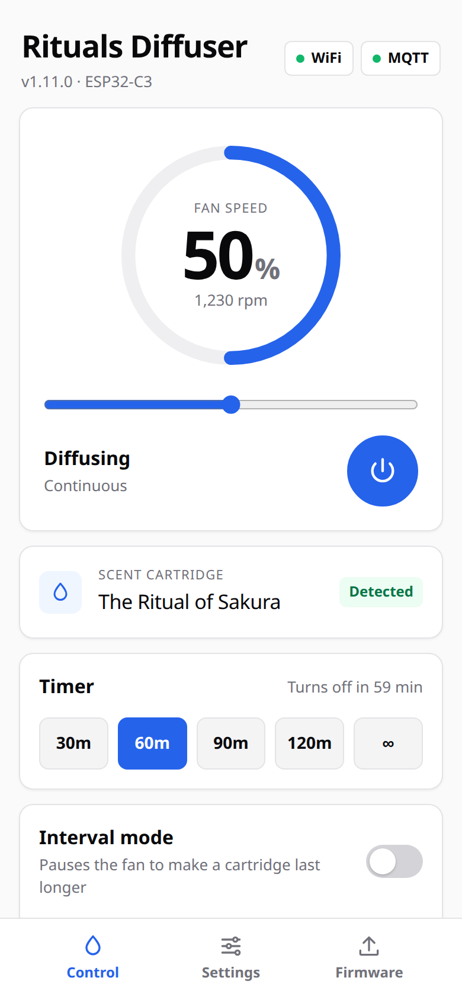
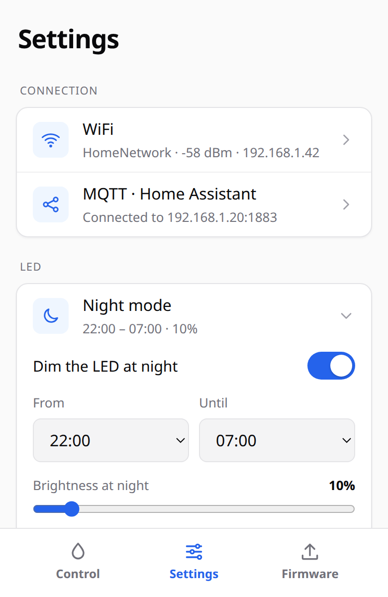
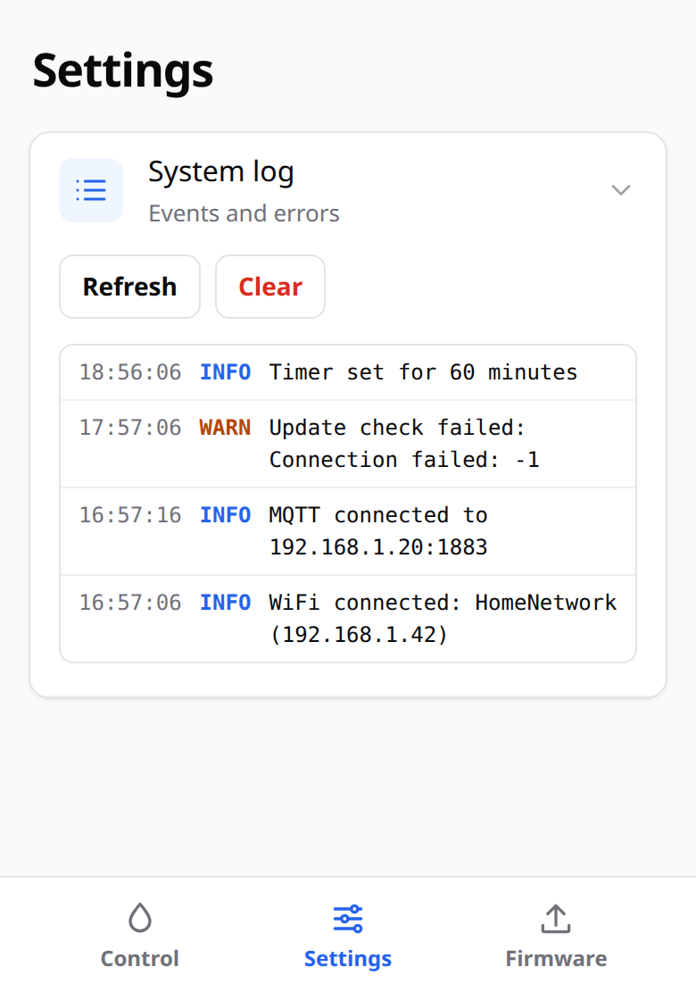
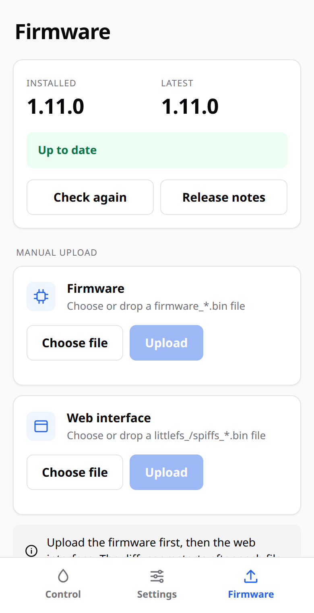
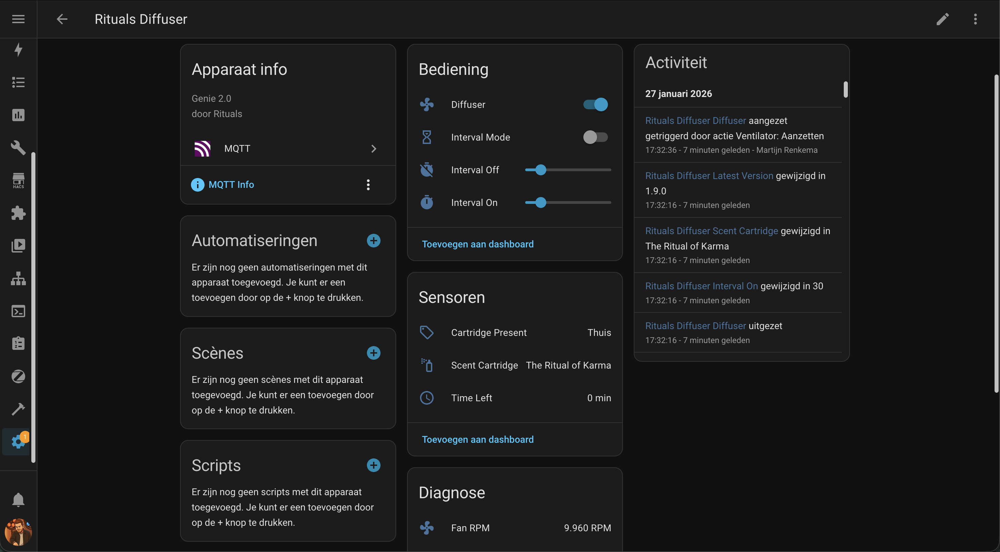
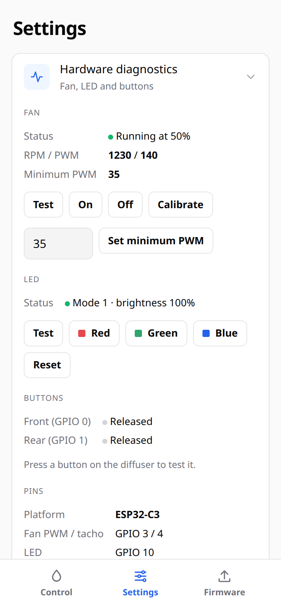

# Rituals Perfume Genie - Custom Firmware

Custom firmware for the Rituals Perfume Genie diffuser (V1 and V2). Replaces the cloud-dependent Rituals firmware with fully local control via Home Assistant.

<p align="center">
  
</p>


> **Community tested!** Both ESP8266 (Rituals Genie V1/V2) and ESP32 versions are actively used by the community. Found an issue? [Report it here](https://github.com/martijnrenkema/Rituals-diffuser/issues).

> **ESP8266 Note:** Versions v1.9.x include experimental features like NFC scent detection and various memory optimizations. If you experience stability issues on ESP8266, use **[v1.8.5](https://github.com/martijnrenkema/Rituals-diffuser/releases/tag/v1.8.5)** as the recommended stable version.

## Features

- **Local Control** - No cloud dependency, works offline
- **Home Assistant Integration** - MQTT auto-discovery
- **NFC Scent Detection** - Automatically detects Rituals scent cartridges (v1.9.0+, experimental on ESP8266)
- **Timer Presets** - 30, 60, 90, 120 minutes + continuous
- **Interval Mode** - Pulsing mode to save fragrance
- **Night Mode** - Auto-dim LED during configured hours
- **Usage Statistics** - Track total runtime
- **OTA Updates** - Wireless firmware updates via web interface
- **Auto-Update** - Checks GitHub for new releases, one-click install (ESP32)
- **Web Interface** - Clean, responsive UI (phone and desktop, light and dark mode) to control the diffuser and configure WiFi, MQTT and passwords
- **RGB LED Status** - Visual feedback for device state
- **Physical Buttons** - Front and rear button support

<p align="center">
  
  
</p>

## Quick Start

### Option 1: Pre-built Binaries (Easiest)

1. Download the latest release from [Releases](https://github.com/martijnrenkema/Rituals-diffuser/releases)
2. Flash using esptool or web flasher (see Installation section)

### Option 2: Build from Source

```bash
# Clone repository
git clone https://github.com/martijnrenkema/Rituals-diffuser.git
cd Rituals-diffuser

# Build for ESP32 (recommended)
pio run -e esp32dev

# Or build for ESP32-C3 SuperMini
pio run -e esp32c3_supermini

# Or build for ESP8266 (original chip)
pio run -e esp8266
```

## Hardware

> **ℹ️ Supported Hardware**
>
> This firmware supports both **Rituals Perfume Genie V1** and **V2** (both contain ESP8266), as well as custom builds with **ESP32** or **ESP32-C3 SuperMini**. Have a different hardware version? Feel free to try and [share your feedback](https://github.com/martijnrenkema/Rituals-diffuser/issues)!

### ESP32 Wiring (Recommended for new builds)

Connect your ESP32 DevKit to the Rituals Genie board:

| ESP32 GPIO | Genie Board | Wire Color | Function |
|------------|-------------|------------|----------|
| GPIO25 | IO4 | Blue | Fan PWM speed control |
| GPIO26 | IO5/TP17 | Yellow | Fan tachometer (RPM) |
| GPIO27 | IO15 | Green | WS2812 RGB LED data |
| GPIO13 | SW2 | - | Front button (Connect) |
| GPIO14 | SW1 | - | Rear button (Reset) |
| GND | GND | Black | Ground |
| 3.3V | 3.3V | Red | Power |

**RC522 NFC Reader (optional):**

| ESP32 GPIO | RC522 Pin | Function |
|------------|-----------|----------|
| GPIO18 | SCK | SPI Clock (VSPI) |
| GPIO23 | MOSI | SPI Data Out |
| GPIO19 | MISO | SPI Data In |
| GPIO16 | SDA/CS | Chip Select |
| GPIO17 | RST | Reset |

> **⚠️ Important: Antenna Placement**
>
> When installing an ESP32 dev board inside the metal housing, position the board so the WiFi antenna points toward the nozzle opening. The metal enclosure acts as a Faraday cage, blocking WiFi signals. The nozzle opening is the only path for the signal to escape.

### ESP8266 Pinout (Genie V1/V2)

| GPIO | Function | Description |
|------|----------|-------------|
| GPIO4 | Fan PWM | Speed control (blue wire) |
| GPIO5 | Fan Tacho | RPM feedback (yellow wire) |
| GPIO15 | LED | WS2812 RGB LED |
| GPIO16 | SW2 | Front/Connect button |
| GPIO3 | SW1 | Rear button (RX pin) |
| GPIO14 | SPI CLK | RC522 SCK (HSPI) |
| GPIO13 | SPI MOSI | RC522 MOSI (HSPI) |
| GPIO12 | SPI MISO | RC522 MISO (HSPI) |
| GPIO0 | RC522 CS | RC522 Chip Select |
| GPIO2 | RC522 RST | RC522 Reset |

> **NFC Reader (RC522)**: The Rituals Genie has a built-in RC522 NFC reader on the HSPI bus (GPIO12/13/14). Active after boot.

### ESP32-C3 SuperMini Pinout

Compact alternative to the full ESP32 DevKit. Can be soldered directly to the original ESP8266 pads on the Rituals Genie board. Uses safe GPIO pins (ADC1 only, avoids strapping pins 2, 8, 9).

| GPIO | Function | Description |
|------|----------|-------------|
| GPIO3 | Fan PWM | Speed control (ADC1, safe) |
| GPIO4 | Fan Tacho | RPM feedback (ADC1, interrupt) |
| GPIO10 | LED | WS2812 RGB LED |
| GPIO0 | SW2 | Front/Connect button |
| GPIO1 | SW1 | Rear button |
| GPIO6 | SPI CLK | RC522 SCK |
| GPIO7 | SPI MOSI | RC522 MOSI |
| GPIO20 | SPI MISO | RC522 MISO |
| GPIO5 | RC522 CS | RC522 Chip Select |
| GPIO21 | RC522 RST | RC522 Reset |

> The ESP32-C3 SuperMini has native USB - no USB-to-serial chip needed. Serial output works directly via USB-C.

## Installation

### Step 1: Backup Original Firmware (Important!)

Before flashing, backup the original Rituals firmware:

```bash
# Find your serial port
ls /dev/cu.usbserial-*

# Backup (2MB flash for ESP8266)
esptool.py --port /dev/cu.usbserial-XXXX read_flash 0x00000 0x200000 rituals_backup.bin
```

### Step 2: Flash Firmware

#### Method A: Using PlatformIO (Recommended)

```bash
# For ESP32
pio run -e esp32dev -t upload --upload-port /dev/cu.usbserial-XXXX
pio run -e esp32dev -t uploadfs --upload-port /dev/cu.usbserial-XXXX

# For ESP8266
pio run -e esp8266 -t upload --upload-port /dev/cu.usbserial-XXXX
pio run -e esp8266 -t uploadfs --upload-port /dev/cu.usbserial-XXXX
```

#### Method B: Using esptool (Pre-built binaries)

> **⚠️ You must flash TWO files: firmware + filesystem (web interface)**
>
> | Chip | File | Address |
> |------|------|---------|
> | ESP8266 | `firmware_esp8266.bin` | `0x0` |
> | ESP8266 | `littlefs_esp8266.bin` | `0x1E0000` |
> | ESP32 | `firmware_esp32.bin` | `0x10000` |
> | ESP32 | `spiffs_esp32.bin` | `0x3D0000` |
>
> **Web flashers don't work!** Tools like ESPHome Flasher only flash to one address. Use `esptool.py` instead.
>
> Install esptool: `pip install esptool` ([Windows/Mac/Linux guide](https://docs.espressif.com/projects/esptool/en/latest/esp32/installation.html))

```bash
# For ESP8266 - flash BOTH files:
esptool.py --port /dev/cu.usbserial-XXXX --chip esp8266 --baud 460800 \
  write_flash 0x0 firmware_esp8266.bin 0x1E0000 littlefs_esp8266.bin

# For ESP32 - flash BOTH files:
esptool.py --port /dev/cu.usbserial-XXXX --chip esp32 --baud 460800 \
  write_flash 0x10000 firmware_esp32.bin 0x3D0000 spiffs_esp32.bin
```

You can also flash them separately:
```bash
# ESP8266
esptool.py --port /dev/cu.usbserial-XXXX --chip esp8266 write_flash 0x0 firmware_esp8266.bin
esptool.py --port /dev/cu.usbserial-XXXX --chip esp8266 write_flash 0x1E0000 littlefs_esp8266.bin

# ESP32
esptool.py --port /dev/cu.usbserial-XXXX --chip esp32 write_flash 0x10000 firmware_esp32.bin
esptool.py --port /dev/cu.usbserial-XXXX --chip esp32 write_flash 0x3D0000 spiffs_esp32.bin
```

### Step 3: Initial Setup

1. Power on the device - LED will pulse orange (AP mode)
2. Connect to WiFi network: `Rituals-Diffuser-XXXX`
3. Password: `diffuser123`
4. Open browser: `http://192.168.4.1`
5. Configure your WiFi credentials
6. Device restarts and connects to your network

### Step 4: Configure MQTT (Optional)

1. Find device IP in your router or use `rituals-diffuser.local`
2. Open web interface
3. Enter MQTT broker settings
4. Device appears automatically in Home Assistant

## Updating Firmware (OTA)

Once installed, you can update wirelessly using one of these methods:

### Method 1: Web Interface (Easiest)

1. Open web interface: `http://rituals-diffuser.local` or device IP
2. Open the **Firmware** tab
3. Upload the firmware `.bin` file
4. Upload the web interface (filesystem) `.bin` file
5. Wait for restart

On ESP32 / ESP32-C3 the Firmware tab can also install new releases from GitHub with one click.

<p align="center">
  
</p>

### Method 2: PlatformIO OTA (Developers)

After the first serial flash, use OTA for subsequent updates:

```bash
# ESP8266 - Firmware
pio run -e esp8266_ota -t upload

# ESP8266 - Filesystem (LittleFS)
pio run -e esp8266_ota -t uploadfs

# ESP32 - Firmware
pio run -e esp32_ota -t upload

# ESP32 - Filesystem (SPIFFS)
pio run -e esp32_ota -t uploadfs
```

**Requirements:**
- Device must be on same network as your computer
- Default hostname: `rituals-diffuser.local`
- Default OTA password: `diffuser-ota` (configurable in web UI → Settings → Passwords)
- OTA port: 3232 (ESP32) / 8266 (ESP8266)

> **Note:** OTA updates don't require flash addresses - the ESP framework handles this automatically.

### Method 3: Manual OTA with espota.py

For firmware updates without PlatformIO:

```bash
# Download espota.py from Arduino ESP32/ESP8266 repository
python espota.py -i <device-ip> -p 3232 -a diffuser-ota -f firmware.bin
```

> **Tip:** For filesystem updates, use the web interface instead - it's easier than espota.py for SPIFFS/LittleFS.

### ESP32 Dual Partition Safety

The ESP32 uses a dual OTA partition scheme for safe updates:

| Partition | Address | Size | Purpose |
|-----------|---------|------|---------|
| app0 (ota_0) | 0x10000 | 1.9MB | OTA slot 0 |
| app1 (ota_1) | 0x1F0000 | 1.9MB | OTA slot 1 |

**How it protects your device:**
1. New firmware is written to the **inactive** partition
2. If write completes successfully, bootloader switches to new partition
3. If update fails mid-write, old partition remains active → **device keeps working**

> **Note:** ESP8266 has a single app partition (no rollback) due to its limited 2MB flash.

## Home Assistant Integration

### MQTT Auto-Discovery

The device automatically appears in Home Assistant when MQTT auto-discovery is enabled. No manual configuration needed!

<p align="center">
  
</p>

### Entities Created

| Entity | Type | Description |
|--------|------|-------------|
| Diffuser | Fan | On/off, speed 0-100%, timer presets |
| Interval Mode | Switch | Pulsing mode toggle |
| Interval On | Number | On-time (10-120 sec) |
| Interval Off | Number | Off-time (10-120 sec) |
| Time Left | Sensor | Remaining timer minutes |
| Fan RPM | Sensor | Current fan speed |
| WiFi Signal | Sensor | Signal strength (dBm) |
| Total Runtime | Sensor | Total device runtime (hours) |
| Scent | Sensor | Current fragrance name (v1.9.0+) |
| Cartridge Present | Binary Sensor | NFC cartridge detected (v1.9.0+) |

### Timer Presets

- 30 minutes
- 60 minutes
- 90 minutes
- 120 minutes
- Continuous

## Button Controls

### Front Button (SW2 - Connect)
| Action | Function |
|--------|----------|
| Short press | Toggle fan on/off |
| Long press (3s) | Start AP mode for WiFi config |

### Rear Button (SW1 - Cold Reset)
| Action | Function |
|--------|----------|
| Short press (<1s) | Restart device |
| Hold 1s | LED blinks red slowly: factory reset warning. Release now to cancel |
| Hold 5s | LED blinks red fast to confirm, then factory reset (clears all settings) |

## LED Status Indicators

| Color | Pattern | Status |
|-------|---------|--------|
| Red | Blinking | Disconnected / Error |
| Red | Slow blink | Rear button held - factory reset warning |
| Cyan | Fast blink | Connecting to WiFi |
| Green | Solid | Fan running |
| Blue | Solid | Timer active |
| Blue | Slow breathing | Timer + Interval combined |
| Purple | Solid | Interval mode active |
| Orange | Pulsing | AP mode (WiFi config) |
| Purple | Fast blink | OTA update in progress |

## Configuration

### Default Passwords

| Function | Default Password | Changeable |
|----------|------------------|------------|
| WiFi AP | `diffuser123` | Yes |
| OTA Updates | `diffuser-ota` | Yes |

Change passwords in the web interface under Settings → Passwords. Minimum 8 characters. Restart required after change.

### Night Mode

Automatically dims the LED during specified hours:
- Configure start/end hour (0-23)
- Set dimmed brightness (0-100%, 0% turns the LED off at night)
- Enable/disable via web interface

Outside night hours the LED runs at full brightness.

## Troubleshooting

### Device won't connect to WiFi
1. Long press front button (3s) to enter AP mode
2. Connect to `Rituals-Diffuser-XXXX`
3. Reconfigure WiFi settings

### Device not appearing in Home Assistant
1. Verify MQTT broker settings
2. Check MQTT broker is reachable
3. Power cycle the device
4. Wait 30 seconds for discovery

### OTA upload fails
1. Ensure device is on same network
2. Try using IP address instead of hostname
3. Check port 3232 is not blocked
4. Fallback: flash via serial connection

### Fan not spinning
1. Check wiring connections
2. Open Settings → Hardware diagnostics in the web interface
3. Press "Test" to verify the fan works
4. Use "Calibrate" or set the minimum PWM if the fan needs a higher starting voltage

<p align="center">
  
</p>

### Can't access 192.168.4.1 (AP mode)

**First, verify you're in AP mode:**
- LED should be **orange pulsing**
- WiFi network `Rituals-Diffuser-XXXX` should be visible
- Password: `diffuser123`

**If AP mode won't start:**
1. AP mode only activates when:
   - No WiFi credentials saved, OR
   - WiFi connection fails 3x (takes ~90 seconds), OR
   - Long press front button (3 seconds)
2. Check serial log for `[WIFI] AP started` and `[WIFI] AP IP: 192.168.4.1`
3. If `[WIFI] ERROR: Failed to start AP!` appears, try factory reset (hold rear button 5 seconds)

**If connected but page won't load:**
1. Use `http://192.168.4.1/` (not https!)
2. Check your phone's WiFi details - Gateway should show `192.168.4.1`
3. Disable mobile data temporarily
4. Try a different browser or device

**If you see "Web interface files missing":**
- You need to flash the filesystem (the web interface files)
- Download `littlefs_esp8266.bin` (ESP8266) or `spiffs_esp32.bin` (ESP32) from the [latest release](https://github.com/martijnrenkema/Rituals-diffuser/releases)
- Flash via web interface (Firmware tab) or esptool:
  ```bash
  # ESP8266: filesystem offset is 0x1E0000
  esptool.py write_flash 0x1E0000 littlefs_esp8266.bin
  ```

**Serial debug commands:**
```bash
# Monitor serial output (115200 baud)
pio device monitor -b 115200

# Or with screen
screen /dev/ttyUSB0 115200
```

Look for these log messages:
- `[WIFI] AP started: Rituals-Diffuser-XXXX` - AP is running
- `[WIFI] AP Password: diffuser123` - Password being used
- `[WIFI] AP IP: 192.168.4.1` - IP address assigned
- `[WEB] Server started on port 80` - Web server ready
- `[WIFI] DNS server started for captive portal` - Captive portal active

## Project Structure

```
├── src/
│   ├── main.cpp              # Main entry point
│   ├── config.h              # Pin definitions & settings
│   ├── fan_controller.*      # Fan control, timer, interval
│   ├── led_controller.*      # WS2812 RGB LED
│   ├── button_handler.*      # Button input handling
│   ├── storage.*             # Settings persistence
│   ├── wifi_manager.*        # WiFi connection
│   ├── web_server.*          # Web interface + OTA
│   ├── mqtt_handler.*        # MQTT + HA discovery
│   ├── state_lock.*          # Mutex between web handlers and main loop (ESP32)
│   └── ota_handler.*         # ArduinoOTA
├── data/                     # Web files (LittleFS on ESP8266, SPIFFS on ESP32)
│   ├── index.html
│   ├── update.html         # Redirect to the Firmware tab (old links)
│   ├── style.css
│   └── script.js
├── platformio.ini
└── README.md
```

## Building from Source

### Prerequisites
- [PlatformIO](https://platformio.org/) (VS Code extension or CLI)
- USB-to-Serial adapter

### Build Commands

```bash
# Build firmware
pio run -e esp32dev        # ESP32
pio run -e esp8266         # ESP8266

# Build filesystem
pio run -e esp32dev -t buildfs
pio run -e esp8266 -t buildfs

# Upload firmware
pio run -e esp32dev -t upload
pio run -e esp8266 -t upload

# Upload filesystem
pio run -e esp32dev -t uploadfs
pio run -e esp8266 -t uploadfs
```

## Dependencies

- [PubSubClient](https://github.com/knolleary/pubsubclient) - MQTT client
- [ArduinoJson](https://github.com/bblanchon/ArduinoJson) - JSON parsing
- [ESPAsyncWebServer](https://github.com/me-no-dev/ESPAsyncWebServer) - Async web server
- [FastLED](https://github.com/FastLED/FastLED) - WS2812 LED control (ESP32)
- [NeoPixelBus](https://github.com/Makuna/NeoPixelBus) - WS2812 LED control (ESP8266)
- [MFRC522](https://github.com/miguelbalboa/rfid) - RC522 RFID reader

Exact versions are pinned in `platformio.ini` so builds are reproducible.

## Credits

- Based on research from the [Home Assistant Community](https://community.home-assistant.io/t/replace-the-software-of-the-rituals-genie-esp-with-esphome/762356)
- Inspired by [Echnics/Perfume-Genie-ESPhome](https://github.com/Echnics/Perfume-Genie-ESPhome)
- Thanks to [@FredericMa](https://github.com/FredericMa) for ESP8266 optimization contributions ([PR #9](https://github.com/martijnrenkema/Rituals-diffuser/pull/9))

## License

MIT License - feel free to use and modify.

## Disclaimer

This project is not affiliated with Rituals Cosmetics. Use at your own risk. Modifying your device may void warranty.

## Changelog

### v1.11.0
**New web interface:**
- Redesigned UI with Control, Settings and Firmware tabs; bottom tab bar on phones, sidebar on desktop
- Follows the system light/dark mode, uses Inter (or the system font), one blue accent colour
- Settings are a grouped list showing the current state (WiFi network, MQTT broker, night mode hours, firmware version); tap a row to edit it
- Firmware updates (check, one-click install on ESP32, manual upload) moved from `update.html` into the Firmware tab; `update.html` redirects there
- Interval times save automatically; notifications replace pop-up alerts
- Smaller than before: 14.4 KB gzipped for all web files (was 15.5 KB)
- ESP8266 Safe Update page restyled to match

**Firmware:**
- New `POST /api/restart` endpoint (used by "Restart device" in Settings)
- ESP32-C3 reports its platform as `ESP32-C3`

### v1.10.0
**Bug Fixes:**
- Front button AP mode no longer disappears after a few seconds (the background WiFi retry fired immediately and closed the AP)
- Total runtime no longer double-counted in Home Assistant (web UI and MQTT now show the same value)
- `/api/status/lite` and `/api/diagnostic/buttons` were answered by the wrong handler (route prefix matching); the diagnostics button test works again and status polling uses the light endpoint
- Failed, interrupted or stalled web OTA uploads no longer leave the device stuck in OTA mode (purple LED), and can no longer interfere with an ArduinoOTA or GitHub update that is already running (ESP32)
- ESP8266: `/api/update/firmware` and `/api/update/filesystem` crashed the device when called directly (Update can't run in the async context). They now return 400; uploads go through Safe Update mode as before
- ESP8266 Safe Update mode recovers from an interrupted upload instead of rejecting every retry until power-cycle
- Filesystem is unmounted and log writes are paused during a web OTA upload, preventing a corrupted filesystem image
- Night mode brightness 0% now really keeps the LED off, and daytime brightness is the same (100%) whether night mode is enabled or not
- Default OTA password is `diffuser-ota` again, as documented (was derived from the MAC address). ESP32 users who used the old `ota-xxxxxx` default with espota/PlatformIO must switch to `diffuser-ota` (or set their own in the web UI)
- LED reconnect status updates immediately when WiFi comes back on its own
- MQTT host/user/password length validation matches the storage size (no silent truncation)
- "Web interface files missing" page names the correct filesystem image

**ESP8266 RAM (static RAM 75.7% → 61.6%, ~12 KB more free heap):**
- Removed unused `ASYNCWEBSERVER_REGEX` build flag: no route uses regex, but it pulled in `std::regex` and the C++ locale tables (~11 KB RAM, ~190 KB flash; ESP32: ~5 KB RAM, ~240 KB flash)
- EEPROM buffer is only allocated while settings are read or written (~440 bytes heap)
- Update checker skips the release asset list on ESP8266 (no auto-update there): ~1 KB less heap during the TLS check, and no risk of the JSON document overflowing on releases with many files
- ESP32-only update URLs no longer reserved on ESP8266 (392 bytes)

**Improvements:**
- Platform and library versions pinned exactly in `platformio.ini` (reproducible builds)
- Rear button: factory reset now needs a 5 second hold. After 1s the LED blinks red as a warning; releasing cancels.
- CSRF protection: state-changing API requests coming from another website (Origin/Referer not matching the device) are rejected, so a web page can no longer trigger reset/upload through your browser. Scripts and curl are unaffected.
- ESP32: HTTP handlers and the main loop are serialized with a mutex (no more races between web requests and fan/MQTT/LED updates)
- ESP8266 Safe Update mode turns the fan off and restarts automatically after 10 minutes without activity
- Fan speed is saved 5s after the last change instead of on every slider step (less flash wear)
- Web OTA upload turns the fan off; fan calibration saves runtime and updates LED/MQTT
- Static files are matched after API routes (fewer filesystem lookups per API call)
- MQTT reconnect backoff capped at 60s as intended

### v1.9.10
**ESP8266 RAM & Stability:**
- Scent table moved to PROGMEM and duplicate settings copy removed: ~2 KB more free RAM on ESP8266 (static RAM 78.2% → 75.7%)
- New build flags for low-RAM ESP8266 builds: `-DESP8266_LITE=1` (disables NFC + scent lookup, ~4 KB RAM saved), or individually `-DENABLE_NFC=0` / `-DENABLE_SCENT=0`
- MQTT reconnect backoff: failed broker connects retry at 5s → doubling up to 60s, so an offline broker no longer stalls the main loop (~3s block) every 5 seconds
- Fix `esp32c3_ota` build environment: missing MFRC522 dependency

### v1.9.9
**Stability & Cleanup:**
- MQTT: `removeDiscovery()` now wipes all 13 entities (no more orphans in Home Assistant). Anonymous brokers work again (nullptr instead of empty user/pass).
- Logger: streams JSON to `/api/logs` instead of buffering (saves ~3 KB heap on ESP8266). Save retries throttled after a failed write.
- Update checker: ESP8266 retries once per hour after a failed first check. Low-heap floor raised to 18 KB.
- ESP8266 OTA upload uses `maxSketchSpace` so Update.begin no longer fails on slightly oversized multipart requests.
- Fan: rejects speed/on/off commands during auto-calibration. Interval times clamped before storage (no more uint8 wrap).
- RFID: unknown cartridges show "Unknown cartridge" instead of raw bytes. Ambiguous hex matches logged.
- Night mode brightness changes apply immediately, no longer wait for the next day/night transition.

### v1.9.8
**Audit Fixes:**
- Fix MQTT speed/interval persistence: changes via Home Assistant now survive reboot
- Fix fan speed=0 invalid state: setting speed to 0 now correctly turns off the fan instead of leaving it "on" at 0%
- Fix update checker error state: error messages now stay visible until next check instead of being instantly cleared
- Fix OTA auto-prepare on page load: visiting /update.html no longer triggers safe mode automatically on ESP8266
- Remove broken `esp32c3_rfid_scan` build environment (referenced non-existent source file)
- Remove unused FastLED dependency from ESP8266 environments (ESP8266 uses NeoPixelBus)
- Fix ESP32 build error: invalid WiFi TX power constant (WIFI_POWER_20_5dBm → WIFI_POWER_19_5dBm)

For older versions, see [GitHub Releases](https://github.com/martijnrenkema/Rituals-diffuser/releases).
